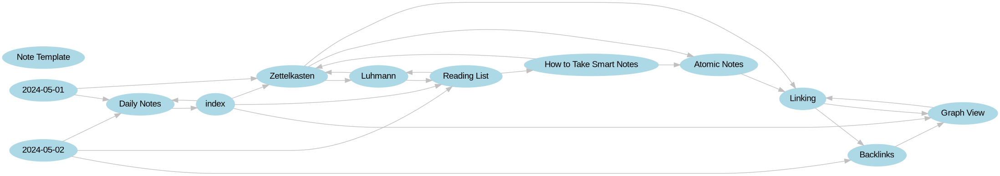

# obsidian-graph-github-action

This GitHub Action scans the Markdown files in a checked-out repository for
Obsidian-style `[[wikilinks]]`, renders the links as a Graphviz PNG, and commits
the result as `obsidian-graph.png`. It is useful when a note graph should be
visible in GitHub without opening the vault in Obsidian.



## Quick start

Create `.github/workflows/generate-graph.yml` in the repository that contains
the vault:

```yaml
name: Generate Obsidian Graph

on:
  push:
    branches: [main]
    paths: ["**.md"]
  workflow_dispatch:

permissions:
  contents: write

jobs:
  generate-graph:
    runs-on: ubuntu-latest
    steps:
      - name: Generate Obsidian Graph
        uses: Bissbert/obsidian-graph-github-action@0.1.6
        with:
          python-version: "3.x"
```

The action checks out the target repository itself, so the calling workflow
does not need a separate checkout step. `contents: write` is required because
the final action step commits and pushes the PNG. The `paths` filter avoids
starting another run for the PNG-only commit.

This workflow has not been run on a hosted runner. Every step after the
checkout and Python setup was run in an `ubuntu:24.04` container, with `git push`
stubbed out; see [`docs/measurement.md`](docs/measurement.md).

## How a run works

```mermaid
flowchart LR
    A["Workflow job"] --> B["actions/checkout@v2<br/>target repository"]
    B --> C["actions/setup-python@v2<br/>selected Python"]
    C --> D["pip install graphviz"]
    D --> E["Copy graph.py<br/>into the workspace"]
    E --> F["Install Graphviz<br/>with apt-get"]
    F --> G["Parse every .md file"]
    G --> H["Build notes and edges"]
    H --> I["Render obsidian-graph.png"]
    I --> J["git add, commit, push"]

    style I fill:#238636,stroke:#3fb950,color:#fff
    style J fill:#8250df,stroke:#bc8cff,color:#fff
```



The action is a composite action defined in [`action.yml`](action.yml). The
parser and renderer are described in
[`docs/graph-generation.md`](docs/graph-generation.md).

## Inputs and outputs

| Name | Required | Default | Description |
|---|:---:|---|---|
| `python-version` | No | `3.x` | Python version passed to `actions/setup-python`. |

The action declares no outputs. Its result is the committed
`obsidian-graph.png` file. The full input, output, and step reference is in
[`docs/action-reference.md`](docs/action-reference.md); its reference tables
are produced from [`action.yml`](action.yml) by
[`tools/action_reference.py`](tools/action_reference.py).

## Capabilities

| Capability | Behaviour |
|---|---|
| Markdown discovery | Recursively visits `*.md` below the working directory. |
| Link detection | Matches the raw text between `[[` and `]]`. |
| Note identity | Uses each Markdown file's stem as its node name. |
| Edge identity | Stores each source/target pair in a set, so duplicates collapse. |
| Rendering | Uses Graphviz `dot` to write a left-to-right PNG. |
| Publishing | Stages only `obsidian-graph.png`, then commits and pushes it when it changed. |

## Results

The fixture vaults were run through the action's own `graph.py` in an
`ubuntu:24.04` container. The counts below come from
`tools/measure.py --sizes 10,50,100 --repeats 1`.

| Fixture | Markdown files | Graph nodes | Unique edges |
|---|---:|---:|---:|
| `hero` | 13 | 13 | 24 |
| `link-forms` | 4 | 9 | 9 |
| synthetic vault | 100 | 100 | 300 |

The 100-note synthetic vault took `3.89 s` and wrote a `5773 KB` PNG at
`14842x5147` pixels. That is one run in a Docker Desktop VM, not a promise
about GitHub-hosted runner performance. Rendering the same vault under two
different `PYTHONHASHSEED` values gives byte-identical PNGs. See
[`docs/measurement.md`](docs/measurement.md) for commands and edge cases.

## Repository layout

```text
action.yml                 composite action metadata and steps
graph.py                   Markdown parser and Graphviz renderer
requirements.txt           Python dependency used by the action
media/                     rendered sample graphs used by the docs
docs/                      component references and measurement notes
tools/                     fixture, rendering, and measurement scripts
```

## License

MIT

## Known limitations

- The parser is a regular expression, not an Obsidian parser. Aliases,
  headings, block references, embeds, and links inside code spans are kept as
  raw target text when they match the pattern.
- Nodes use file stems rather than paths. Two files with the same stem become
  one graph node, and a link to a note that does not exist still becomes a
  Graphviz target node.
- Markdown is read as UTF-8. One file with another encoding stops the graph
  step before a PNG is written.
- The workflow installs Graphviz with `apt-get`, so the example requires an
  Ubuntu runner with passwordless `sudo`. Fork pull requests and protected
  branches may still reject the push.
- The quick-start example pins the action by tag. A tag that no longer resolves
  in this repository has to be replaced with one that does before the workflow
  will run.

Report bugs as [GitHub issues](https://github.com/Bissbert/obsidian-graph-github-action/issues).
