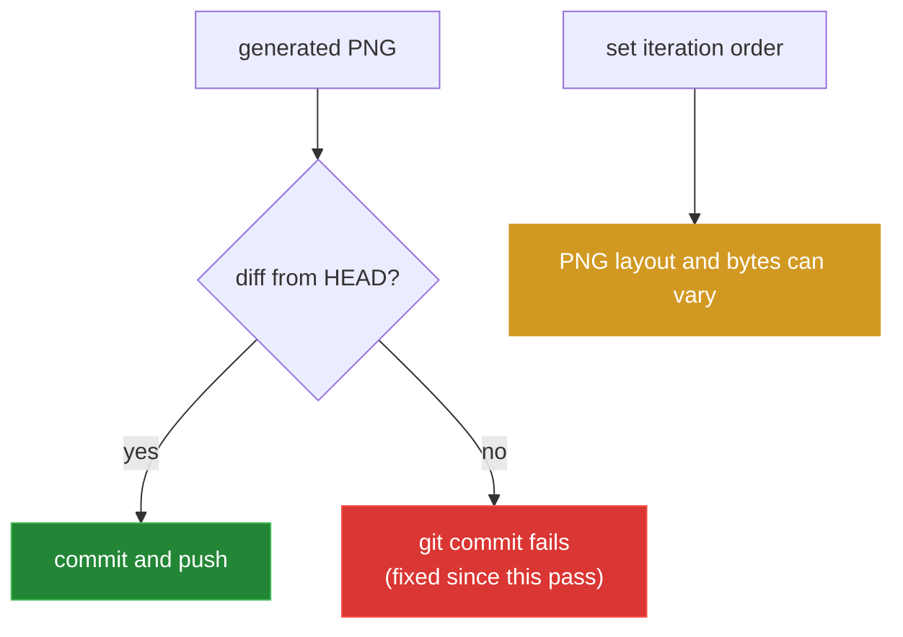

[← back to the overview](../README.md)

# Bugs found

This pass records the existing behaviors below. The proposed source changes
are examples only; none of them was applied during the documentation pass
itself.

> **Since this pass:** an independent adjudication confirmed the first and
> third entries and rejected the second. A subsequent fix pass applied both
> confirmed entries to the default branch: the unguarded commit step in commit
> `fbbea03`, and the set-order rendering in commit `ba5e711`. The old
> quick-start tag was left alone. Read the reproductions, the diagram and the
> example diffs below as the state at the time of the pass, not as the current
> state of the default branch.


## Unchanged output makes the action fail

**Location:** `action.yml`, lines 42–48, especially line 47.

**What happens:** The final step stages `obsidian-graph.png` and always runs
`git commit`. When the PNG is unchanged, Git reports `nothing to commit,
working tree clean`, returns exit `1`, and the action stops before `git push`.

**How it was reproduced:**

```sh
.docs-pass-venv/bin/python tools/check_commit_step.py
```

The script created a temporary repository. Its changed-image case exited `0`;
its unchanged-image case exited `1` with the message above.

**Fix I would have made, but did not make:**

```diff
         git config user.email "github-actions@github.com"
         git add obsidian-graph.png
+        git diff --cached --quiet -- obsidian-graph.png && exit 0
         git commit -m "Update Obsidian graph"
         git push
```

## The old quick-start tag does not resolve

**Location:** Original `README.md`, line 31 in `git show HEAD:README.md`.

**What happens:** The old example used
`Bissbert/obsidian-graph-github-action@v1`. The remote tag query returned the
`0.1.x` tags through `0.1.6` and no `v1` tag, so that workflow reference
cannot resolve.

**How it was reproduced:**

```sh
git show HEAD:README.md | sed -n '30,33p'
git ls-remote --tags origin 'refs/tags/v1*'
```

The README now uses `@0.1.6`, an existing tag observed in the repository's tag
listing.

**Fix I would have made, but did not make to tracked source:**

```diff
-        uses: Bissbert/obsidian-graph-github-action@v1
+        uses: Bissbert/obsidian-graph-github-action@0.1.6
```

This documentation correction is in the new README, which is an allowed
documentation file.

## PNG layout is sensitive to set iteration order

**Location:** `graph.py`, lines 19–20 and 45–52.

**What happens:** Notes and edges are collected in sets and then handed to
Graphviz in set iteration order. Separate processes can therefore insert the
same graph in a different order and produce different PNG bytes and layout
dimensions.

**How it was reproduced:**

```sh
PYTHONHASHSEED=0 .docs-pass-venv/bin/python tools/render_media.py --outdir SEED0
PYTHONHASHSEED=1 .docs-pass-venv/bin/python tools/render_media.py --outdir SEED1
sha256sum SEED0/sample-graph.png SEED1/sample-graph.png
```

The actual run produced different hashes. The first sample PNG was
`1890x479` and the second was `2223x387`, with different file sizes.

**Fix I would have made, but did not make:**

```diff
-    for note in notes:
+    for note in sorted(notes):
         logger.debug(f"Adding node: {note}")
         dot.node(note)

     # Add edges
-    for note_a, note_b in edges:
+    for note_a, note_b in sorted(edges):
         logger.debug(f"Adding edge from '{note_a}' to '{note_b}'")
         dot.edge(note_a, note_b)
```
