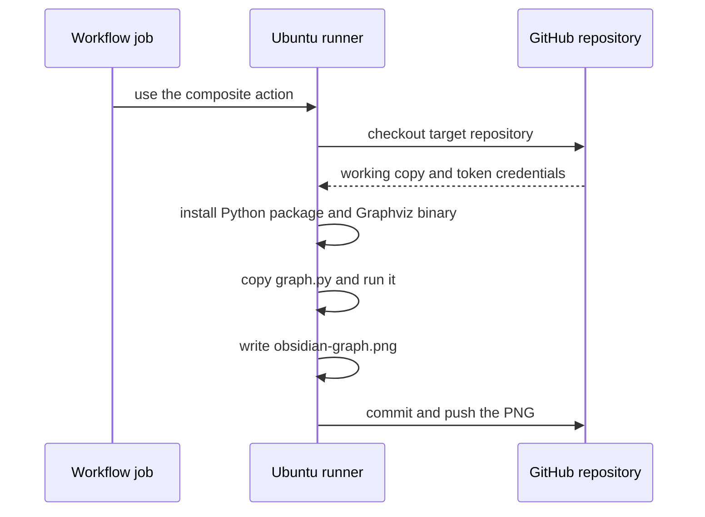
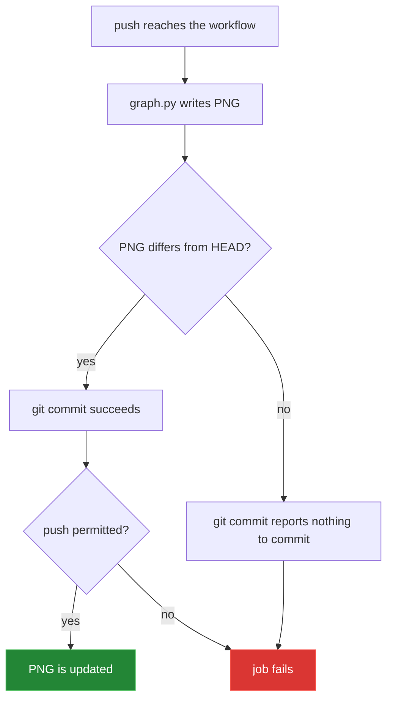

[← back to the overview](../README.md)

# Action reference

The reference block below is produced from [`action.yml`](../action.yml) by
[`tools/action_reference.py`](../tools/action_reference.py):

```sh
python3 tools/action_reference.py
```

**Generate Obsidian Graph** - Parses Markdown files in a repository to generate
an Obsidian-style graph. Runs as a `composite` action.

## Inputs

| Name | Description | Required | Default |
|---|---|:--:|---|
| `python-version` | Version of Python to install. | false | `3.x` |

## Outputs

None. `action.yml` declares no `outputs:` block, so nothing can be read with
`steps.<id>.outputs.*`. The result is the committed `obsidian-graph.png`.

## Steps

| # | Step | Runs |
|---:|---|---|
| 1 | Check out repository | `actions/checkout@v2` |
| 2 | Set up Python | `actions/setup-python@v2` |
| 3 | Install dependencies | `pip install graphviz` |
| 4 | Copy graph.py to target repository | `cp $GITHUB_ACTION_PATH/graph.py .` |
| 5 | Install graphviz | `sudo apt-get update && sudo apt-get install -y graphviz` |
| 6 | Generate Graph | `python graph.py` |
| 7 | Commit and Push Graph | `git config user.name "github-actions[bot]"`<br/>`git config user.email "github-actions@github.com"`<br/>`git add obsidian-graph.png`<br/>`git commit -m "Update Obsidian graph"`<br/>`git push` |

## Run sequence



The action checks out the target repository itself. Do not add a second
checkout step unless the calling workflow intentionally needs different
checkout options.

## Runner and permissions

The job needs:

```yaml
permissions:
  contents: write
```

The final `git push` uses the credentials left by `actions/checkout`. The job
also needs an Ubuntu runner with `apt-get` and passwordless `sudo`, because the
action installs the Graphviz executable during the run.

Pull requests from forks normally receive a read-only token, and protected
branches can reject a direct push even when the workflow declares write
permission.

## Pinning the action

The quick-start example uses `@0.1.6`. The repository's tag listing was checked
with `git ls-remote --tags origin`; it contains the `0.1.x` tags through
`0.1.6` and no `v1` tag. An earlier `@v1` example therefore fails before the
action runs.

## Failure modes



| Symptom | Cause | Response |
|---|---|---|
| `nothing to commit, working tree clean` | The generated PNG is unchanged and the action has no clean-tree guard. | Trigger on Markdown changes with a `paths` filter, or maintain the action separately. |
| Push permission denied | Missing `contents: write`, a fork token, or a protected branch. | Use a push-capable workflow context and branch policy. |
| `Unable to resolve action ... @v1` | There is no `v1` tag in the repository tag listing. | Pin an existing tag such as `@0.1.6`. |
| `UnicodeDecodeError` | A Markdown file is not UTF-8. | Convert the file to UTF-8 before running the action. |
| `sudo` or `apt-get` unavailable | The job is not on a compatible Ubuntu runner. | Use `runs-on: ubuntu-latest`. |
