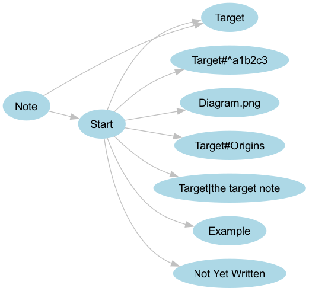

[← back to the overview](../README.md)

# How the graph is generated

[`graph.py`](../graph.py) runs in the root of the checked-out repository. It
reads every Markdown file below the current directory and writes one PNG. It
has no command-line arguments or configuration file.

## Parsing contract

| Source code operation | Result |
|---|---|
| `Path(".").glob("**/*.md")` | Visits Markdown files recursively, including files below dotted directories. |
| `Path.stem` | Turns each file name into the source node name and discards its directory and suffix. |
| `re.findall(r"\[\[([^\]]+)\]\]", content)` | Captures the raw text between the brackets. |
| `notes.add(...)` and `edges.add(...)` | Removes duplicate source nodes and duplicate source/target pairs. |
| `dot.edge(source, target)` | Lets Graphviz create a target node even when no matching Markdown file exists. |

The parser does not resolve Obsidian semantics. It does not split aliases,
headings, or block references, and it does not know that a link inside a code
span is literal text. Anything that matches the regular expression is treated
as an edge.

## What the parser sees

The image above comes from
[`tools/sample_vault.py`](../tools/sample_vault.py) and the action's own
`graph.py`, run by [`tools/render_media.py`](../tools/render_media.py).

| Markdown text | Target node created by `graph.py` |
|---|---|
| `[[Target]]` | `Target` |
| `[[Target\|the target note]]` | `Target\|the target note` |
| `[[Target#Origins]]` | `Target#Origins` |
| `[[Target#^a1b2c3]]` | `Target#^a1b2c3` |
| `![[Diagram.png]]` | `Diagram.png` |
| `[[Not Yet Written]]` | `Not Yet Written` |
| `[[Example]]` | `Example` |
| `projects/Note.md` and `archive/Note.md` | One node named `Note` |

## Rendering

`create_graph()` gives Graphviz these fixed attributes:

| Attribute | Value | Effect |
|---|---|---|
| `format` | `png` | Writes a raster image. |
| `rankdir` | `LR` | Lays out the graph from left to right. |
| node `shape` | `ellipse` | Uses ellipse nodes. |
| node `style` and `color` | `filled` and `lightblue` | Fills and outlines nodes. |
| node and edge `fontname` | `Arial` | Requests Arial where available. |
| edge `color` | `gray` | Draws gray edges. |

The renderer calls `dot.render("obsidian-graph", cleanup=True)`. The resulting
`obsidian-graph.png` is written in the workspace and the intermediate DOT file
is removed.

## Observed edge cases

These rows are from [`tools/edge_cases.py`](../tools/edge_cases.py), which
creates temporary vaults and runs the actual `graph.py`:

| Scenario | Exit | Notes | Edges | Output |
|---|---:|---:|---:|---|
| Empty vault | 0 | 0 | 0 | `114 B`, `11x11` PNG |
| Hidden directories included | 0 | 3 | 3 | `585x203` PNG |
| Same stem in two folders | 0 | 3 | 2 | `233x131` PNG |
| Link to itself | 0 | 1 | 1 | `153x83` PNG |
| Duplicate link in one note | 0 | 2 | 1 | `203x59` PNG |
| One non-UTF-8 file | 1 | — | — | No PNG; `UnicodeDecodeError` |

The full command, environment, and raw measurement scope are recorded in
[`measurement.md`](measurement.md).
