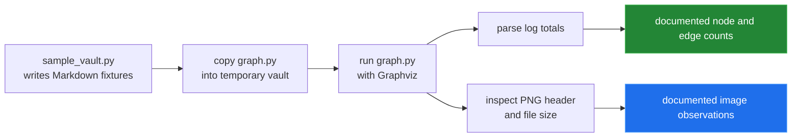

[← back to the overview](../README.md)

# How this pass was measured

Every measured value in the documentation comes from a command run against the
current repository. The scripts live in [tools/](../tools) and use only the
standard library plus the action's existing Python graphviz dependency.

## Environment

The base Python interpreter did not have the graphviz package installed. A
temporary .docs-pass-venv was created inside the repository and used only for
this pass; the package was not installed system-wide. The Graphviz executable
was already available.

Setup commands:

```sh
python3 -m venv .docs-pass-venv
.docs-pass-venv/bin/python -m pip install graphviz
```

Commands run:

```sh
python3 --version
python3 -c 'import graphviz; print(graphviz.__version__)'
dot -V
python3 tools/action_reference.py
```

Observed environment:

| Command | Output used by this pass |
|---|---|
| `python3 --version` | Python 3.11.5 |
| `dot -V` | Graphviz 14.0.2 |
| `python3 tools/action_reference.py` | One input, no declared outputs, and the seven steps in action.yml |

The package-version command could not run in the base interpreter because the
module was absent. The temporary environment installed graphviz 0.21 to run
the action's Python code.

## The local graph harness

[tools/render_media.py](../tools/render_media.py) and
[tools/measure.py](../tools/measure.py) both reproduce the action's local work:
write a temporary vault, copy the repository's graph.py into it, and run
python graph.py. No parser function is substituted for the subprocess run when
PNG output is measured.



## Demo and scale run

Commands:

```sh
.docs-pass-venv/bin/python tools/render_media.py
.docs-pass-venv/bin/python tools/measure.py --sizes 10,50,100 --repeats 1
```

The measurement command printed Best of 1 runs. and these rows:

| Vault | Markdown files | Nodes | Edges | Parse | Full run | PNG | Pixels |
|---|---:|---:|---:|---:|---:|---:|---|
| hero | 13 | 13 | 24 | — | — | 75.1 KB | 1328x416 |
| link-forms | 4 | 9 | 9 | — | — | 50.8 KB | 521x491 |
| synthetic | 10 | 10 | 30 | 0.7 ms | 0.22 s | 88 KB | 1804x435 |
| synthetic | 50 | 50 | 150 | 1.9 ms | 1.02 s | 1577 KB | 7881x2587 |
| synthetic | 100 | 100 | 300 | 3.1 ms | 3.61 s | 5262 KB | 15984x5527 |

The hero and link-forms rows are parser and PNG observations from the same
command. Their full-run time is not printed by the demo section and is left
unmeasured here. Graphviz iterates over Python sets supplied by graph.py, so
layout dimensions and PNG size can differ between processes even for the same
fixture.

## Edge cases

Command:

```sh
.docs-pass-venv/bin/python tools/edge_cases.py
```

The command produced:

| Scenario | Exit | Notes | Edges | PNG |
|---|---:|---:|---:|---|
| Empty vault, no Markdown | 0 | 0 | 0 | 114 B, 11x11 |
| Notes in hidden directories | 0 | 3 | 3 | 20,961 B, 585x203 |
| Same stem in two folders | 0 | 3 | 2 | 8,951 B, 233x131 |
| Note linking to itself | 0 | 1 | 1 | 4,581 B, 153x83 |
| Same link twice in one note | 0 | 2 | 1 | 2,766 B, 203x59 |
| One file not UTF-8 | 1 | — | — | no PNG |
| Note name with a quote | 0 | 2 | 1 | 5,891 B, 292x59 |

The non-UTF-8 row also printed UnicodeDecodeError. The other rows exited
cleanly.

## Commit-step check

Command:

```sh
.docs-pass-venv/bin/python tools/check_commit_step.py
```

The changed-image case exited 0. The unchanged-image case exited 1 and printed
nothing to commit, working tree clean. This reproduces the commit commands in
[action.yml](../action.yml) up to, but not including, git push.

## Verification boundary

The complete GitHub Actions workflow was not run in this pass. Doing so would
require a hosted runner, a repository checkout, and a token authorized to push
a commit. The local copy, parse, Graphviz render, and commit-step behavior were
run; hosted workflow authentication, permissions, and the remote push remain
unverified.

No animation is included. A real action animation would need a captured hosted
run, and no terminal output or remote run was staged or fabricated.
