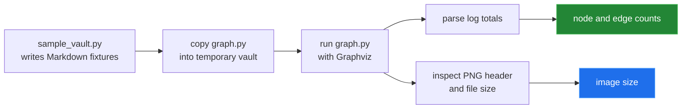

[← back to the overview](../README.md)

# How this was measured

Every number and image in this documentation comes from one script run in a
Linux container:

```sh
sh tools/linux-run.sh > media/captures/linux-run.txt
```

[`tools/linux-run.sh`](../tools/linux-run.sh) starts `ubuntu:24.04`, the image
behind GitHub's `ubuntu-latest` runner. It installs Graphviz with `apt-get` as
`action.yml` does, and the `graphviz` Python package in a venv. It copies the
read-only repository and runs each script in [`tools/`](../tools). The two
PNGs in `media/` are written back through a second mount. The full output is
[`media/captures/linux-run.txt`](../media/captures/linux-run.txt); every block
below is taken from it.

## Environment

| | |
|---|---|
| Kernel | Linux 6.5.11-linuxkit, aarch64 (Docker Desktop VM) |
| Image | `ubuntu:24.04` (`sha256:008173c2…bf33ca3`), Ubuntu 24.04.5 LTS |
| Python | 3.12.3, `graphviz` package 0.21 |
| Graphviz | `dot` 2.43.0 (Ubuntu package) |
| Git | 2.43.0 |
| Date | 2026-09-24 |

## The local graph harness

[`tools/render_media.py`](../tools/render_media.py),
[`tools/measure.py`](../tools/measure.py) and
[`tools/edge_cases.py`](../tools/edge_cases.py) all do what the action does:
write a vault, copy `graph.py` into it, and run `python graph.py` there.



## Demo and scale run

```sh
python3 tools/render_media.py
python3 tools/measure.py --sizes 10,50,100 --repeats 1
```

| Vault | Markdown files | Nodes | Edges | Parse | Full run | PNG | Pixels |
|---|---:|---:|---:|---:|---:|---:|---|
| hero | 13 | 13 | 24 | — | — | 87.5 KB | 2196x387 |
| link-forms | 4 | 9 | 9 | — | — | 49.5 KB | 514x491 |
| synthetic | 10 | 10 | 30 | 0.3 ms | 0.07 s | 91 KB | 1777x533 |
| synthetic | 50 | 50 | 150 | 0.8 ms | 0.63 s | 1323 KB | 6676x2462 |
| synthetic | 100 | 100 | 300 | 1.6 ms | 3.89 s | 5773 KB | 14842x5147 |

Each row is one run. The demo vaults are not timed. Almost all of the time is
Graphviz layout and rendering; parsing stays under 2 ms.

`media/sample-graph.png` (89,602 bytes) and `media/link-forms.png`
(50,685 bytes) are the two demo renders.

## Same input, same PNG

The demo vaults were rendered twice, with `PYTHONHASHSEED=0` and
`PYTHONHASHSEED=1`. All four PNGs hash the same per vault (`identical`). Before
[`ba5e711`](https://github.com/Bissbert/obsidian-graph-github-action/commit/ba5e711)
the layout depended on set iteration order.

## Edge cases

```sh
python3 tools/edge_cases.py
```

| Scenario | Exit | Notes | Edges | PNG |
|---|---:|---:|---:|---|
| Empty vault, no Markdown | 0 | 0 | 0 | 114 B, 11x11 |
| Notes in hidden directories | 0 | 3 | 3 | 21,817 B, 575x203 |
| Same stem in two folders | 0 | 3 | 2 | 8,535 B, 230x131 |
| Note linking to itself | 0 | 1 | 1 | 4,428 B, 151x83 |
| Same link twice in one note | 0 | 2 | 1 | 2,750 B, 203x59 |
| One file not UTF-8 | 1 | — | — | no PNG |
| Note name with a quote | 0 | 2 | 1 | 5,812 B, 290x59 |

The non-UTF-8 row stops with `UnicodeDecodeError: 'utf-8' codec can't decode
byte 0xe9 in position 3`.

## Commit step

```sh
python3 tools/check_commit_step.py
```

The script runs the "Commit and Push Graph" step exactly as `action.yml`
defines it, in a throwaway repository, with `git push` replaced by `echo PUSH`.
A new graph is committed and reaches the push; the same graph again exits 0
with `Obsidian graph is unchanged; skipping commit`. Before
[`fbbea03`](https://github.com/Bissbert/obsidian-graph-github-action/commit/fbbea03)
an unchanged graph made the action fail.

## Not run

The workflow has not run on a GitHub-hosted runner. That needs a
repository, a runner and a token that can push. `actions/checkout`,
`actions/setup-python`, authentication and the real `git push` are therefore
untested. Everything after them was run in the container.
